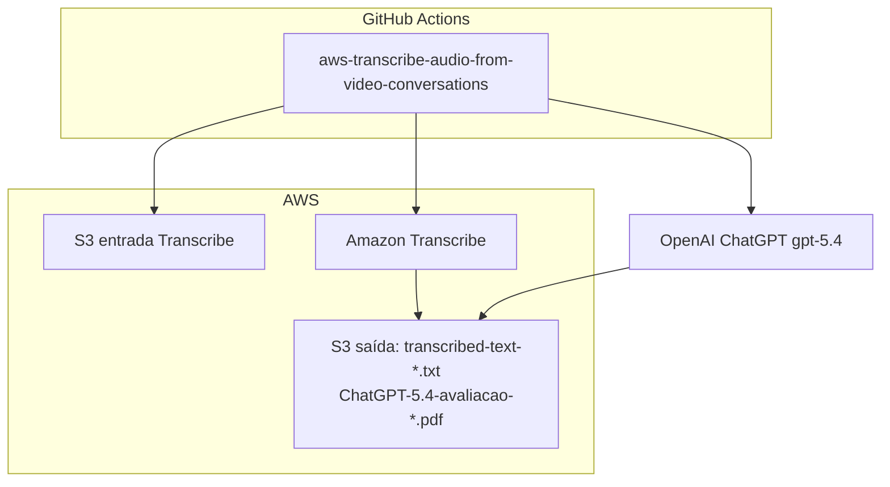

# Pipeline YOLOv8 Pose + Amazon Transcribe + ChatGPT (produção)

Este repositório extrai a lógica do notebook Colab `yolov8_pose_colab_v3_detecção_da_violencia_integração_AWS_S3_1_2.ipynb` para um **pacote Python** executável em container, com **infraestrutura como código (Terraform)** na AWS (S3, ECR, ECS Fargate, **Amazon Transcribe**) e **CI/CD** no GitHub Actions.

Inclui o fluxo **`aws-transcribe-audio-from-video-conversations`**: transcrição de vídeos/áudios no S3, análise de risco com **ChatGPT (OpenAI)** e geração de relatórios em PDF.

> **Segurança:** se você já versionou credenciais AWS em arquivos locais (por exemplo `configuração_pastas.txt`), **revogue essas chaves no IAM** e use apenas perfis locais (`aws configure`), variáveis de ambiente em CI ou **IAM roles** (ECS task role / OIDC no GitHub). O arquivo `configuração_pastas.txt` está no `.gitignore` deste projeto.

---

## O que o pipeline faz (passo a passo)

1. **Entrada:** lê a chave `S3_INPUT_KEY` no bucket `S3_INPUT_BUCKET` e baixa o vídeo para um diretório de trabalho (`WORK_DIR`).
2. **Modelo:** carrega o Ultralytics YOLO (`MODEL_NAME`, padrão `yolov8n-pose.pt`).
3. **Predict:** executa `model.predict` com `save=True`, gera o vídeo intermediário na pasta de runs do YOLO e **envia** esse arquivo para `S3_PREDICT_BUCKET`.
4. **Anotação “violência”:** percorre o vídeo frame a frame com `save=False`, aplica a função placeholder `is_violence_detected` (mesma ideia do notebook) e grava um MP4 com aviso visual quando a heurística dispara.
5. **Saída:** envia o MP4 final para `S3_OUTPUT_BUCKET`.

A aplicação segue o padrão **12-factor**: toda configuração vem de **variáveis de ambiente** (não há segredos no código).

### Pipeline `aws-transcribe-audio-from-video-conversations`

1. **Entrada:** lista todos os vídeos/áudios em `TRANSCRIBE_S3_INPUT_BUCKET` (padrão: `transcribe-violence-input-fiap-posttech-iadevs-tcfase04`).
2. **Amazon Transcribe:** extrai o texto de cada arquivo (idioma padrão `pt-BR`).
3. **Arquivo TXT:** grava `transcribed-text-<nome-original>.txt` em `TRANSCRIBE_S3_OUTPUT_BUCKET` (padrão: `transcribe-violence-output-fiap-posttech-iadevs-tcfase0`).
4. **ChatGPT:** modelo `OPENAI_MODEL` (padrão `gpt-5.4`) classifica risco (segurança, integridade, ameaça, crime, risco à mulher).
5. **PDF:** grava `ChatGPT-5.4-avaliacao-conteudo-<nome-original>.pdf` no mesmo bucket de saída.

Comando CLI: `yolo-transcribe` (ou `yolo-violence transcribe-analyze`)

Roteiro de configuração manual: [`docs/ROTEIRO-CONFIGURACAO-MANUAL-TRANSCRIBE.md`](docs/ROTEIRO-CONFIGURACAO-MANUAL-TRANSCRIBE.md)

---

## Estrutura do repositório

| Caminho | Função |
|--------|--------|
| `src/yolo_violence_pipeline/` | Código de produção (`config`, `s3_io`, `violence`, `pipeline`, `cli`) |
| `tests/` | Testes unitários (rápidos, sem baixar pesos YOLO) |
| `terraform/` | IaC: buckets S3, ECR, IAM, ECS Fargate (VPC padrão) |
| `docs/` | Diagramas de arquitetura editáveis (Mermaid `.mmd`, SVG) |
| `Dockerfile` | Imagem de runtime com Python 3.11 e dependências de vídeo |
| `.github/workflows/ci-cd.yml` | CI (testes, Ruff, build Docker, Terraform validate) e CD manual |
| `.github/workflows/aws-transcribe-audio-from-video-conversations.yml` | Transcribe + ChatGPT no runner GitHub |
| `scripts/run_local.ps1` / `run_local.sh` | Execução local com `.env` (instala `[dev,runtime]`) |
| `scripts/docker_run.sh` | Build da imagem e `docker run --env-file .env` |

---

## Requisitos locais

- **Python 3.11+** (recomendado 3.11 em Linux/macOS/Windows com caminhos longos habilitados se for instalar PyTorch).
- **Docker** (para build da imagem).
- **Terraform** ≥ 1.5 (para provisionar a AWS).
- **AWS CLI** autenticado na conta alvo.

Dependências de **runtime** (YOLO + OpenCV) estão no extra opcional `[runtime]` do `pyproject.toml`. Os testes em CI usam apenas `[dev]` para serem leves.

---

## Configuração rápida (local)

1. Copie o exemplo de ambiente:

   ```bash
   cp .env.example .env
   ```

2. Ajuste buckets e chave do objeto (valores alinhados ao output do Terraform).

3. **Windows (PowerShell):**

   ```powershell
   .\scripts\run_local.ps1
   ```

4. **Linux/macOS:**

   ```bash
   chmod +x scripts/run_local.sh
   ./scripts/run_local.sh
   ```

Na AWS (ECS), as credenciais vêm automaticamente da **task role** — não configure `AWS_ACCESS_KEY_ID` no container.

---

## Infraestrutura (Terraform)

### Passo a passo

1. Entre na pasta `terraform` e copie variáveis:

   ```bash
   cd terraform
   cp terraform.tfvars.example terraform.tfvars
   ```

   Edite `bucket_suffix` para um valor **únio globalmente** (nomes de bucket S3 são únicos na AWS). Se deixar vazio, um sufixo aleatório é gerado.

2. Inicialize e aplique:

   ```bash
   terraform init
   terraform plan
   terraform apply
   ```

3. Faça o **primeiro push** da imagem para o ECR (o ECS precisa de uma imagem existente). Use o output `ecr_repository_url`:

   ```bash
   aws ecr get-login-password --region us-east-1 | docker login --username AWS --password-stdin <account>.dkr.ecr.us-east-1.amazonaws.com
   docker build -t yolo-violence:latest ..
   docker tag yolo-violence:latest <ecr_repository_url>:latest
   docker push <ecr_repository_url>:latest
   ```

4. Após mudanças na imagem com a tag `latest`, o ECS pode continuar usando uma revisão antiga da task definition. Opções: rode `terraform apply` de novo (ajuste `ecr_image_tag` se usar tags imutáveis) ou registre uma nova revisão apontando para o digest desejado.

5. **Executar uma tarefa** (processamento pontual no Fargate):

   - Defina `S3_INPUT_KEY` (via override do `run-task` ou variável `default_s3_input_key` no Terraform).
   - Use os outputs `ecs_cluster_name`, `ecs_task_definition_family`, `default_subnet_ids`, `ecs_task_security_group_id`.

   Exemplo de override (conceitual): variável de ambiente `S3_INPUT_KEY` no container.

### OIDC do GitHub (opcional)

No `terraform.tfvars`, defina:

```hcl
github_oidc_enabled = true
github_repository   = "sua-org/seu-repo"
```

Isso cria o provedor OIDC (se ainda não existir na conta) e uma role para o Actions fazer push no ECR e `RunTask`. Se o provedor `token.actions.githubusercontent.com` já existir, importe-o ou ajuste o Terraform conforme a política da sua empresa.

---

## CI/CD (GitHub Actions)

| Gatilho | Comportamento |
|--------|----------------|
| **Pull request / push em `main`** | Ruff, Pytest, `docker build` (validação), `terraform fmt` + `init -backend=false` + `validate` |
| **workflow_dispatch** (“Run workflow”) | Passos opcionais: push da imagem para o ECR e, se configurado, `RunTask` no Fargate |

### Secrets recomendados (CD manual)

| Secret | Uso | Valor / origem |
|--------|-----|----------------|
| `AWS_ROLE_ARN` | OIDC — ECR, ECS, S3 Transcribe, API Transcribe | Output `terraform output -raw github_actions_role_arn` |
| `ECR_REPOSITORY_NAME` | Push da imagem Docker | Nome do repositório ECR (ex.: `yolo-violence-prod-app`) |
| `ECS_CLUSTER_NAME` | RunTask YOLO | Output `ecs_cluster_name` |
| `ECS_TASK_DEFINITION_FAMILY` | RunTask YOLO | Output `ecs_task_definition_family` |
| `ECS_CONTAINER_NAME` | RunTask YOLO | Output `ecs_task_container_name` |
| `ECS_SUBNET_IDS` | Rede Fargate | `terraform output -raw ecs_subnet_ids_csv` |
| `ECS_SECURITY_GROUP_ID` | Rede Fargate | `terraform output -raw ecs_task_security_group_id` |
| **`OPENAI_API_KEY`** | **ChatGPT (fluxo Transcribe)** | Chave `sk-...` em [platform.openai.com/api-keys](https://platform.openai.com/api-keys) — **nunca** commitar |

**Amazon Transcribe** não exige secret próprio no GitHub: a autenticação é feita pela role AWS (`AWS_ROLE_ARN`) com permissões `transcribe:*` e S3 nos buckets de entrada/saída (provisionados no Terraform).

Variáveis de ambiente do workflow Transcribe (já definidas no YAML; altere se seus buckets forem outros):

| Variável | Valor padrão no workflow |
|----------|---------------------------|
| `TRANSCRIBE_S3_INPUT_BUCKET` | `transcribe-violence-input-fiap-posttech-iadevs-tcfase04` |
| `TRANSCRIBE_S3_OUTPUT_BUCKET` | `transcribe-violence-output-fiap-posttech-iadevs-tcfase0` |
| `OPENAI_MODEL` | `gpt-5.4` |
| `TRANSCRIBE_LANGUAGE_CODE` | `pt-BR` |

> Se a tarefa ficar em **PENDING**, quase sempre é rede: subnets sem rota para Internet (IGW) ou `ECS_SUBNET_IDS` / `ECS_SECURITY_GROUP_ID` desatualizados após `terraform apply`. Rode `terraform output -raw ecs_subnet_ids_csv` e atualize o secret no GitHub.

---

## Diagrama da infraestrutura

### Versão 2 (YOLO + Transcribe + ChatGPT)

| Formato | Arquivo |
|--------|---------|
| **PNG** | [`docs/Diagrama de Arquitetura de Infraestrutura-v2.png`](docs/Diagrama%20de%20Arquitetura%20de%20Infraestrutura-v2.png) |
| **Mermaid V2** | [`docs/diagrama-arquitetura-infraestrutura-v2.mmd`](docs/diagrama-arquitetura-infraestrutura-v2.mmd) |
| **Documento V2** | [`docs/Documento de Arquitetura V2.docx`](docs/Documento%20de%20Arquitetura%20V2.docx) · [`docs/Documento de Arquitetura V2.pdf`](docs/Documento%20de%20Arquitetura%20V2.pdf) |


### Versão 1 (somente YOLO)

| Formato | Arquivo | Como editar |
|--------|---------|-------------|
| **Mermaid** | [`docs/diagrama-arquitetura-infraestrutura.mmd`](docs/diagrama-arquitetura-infraestrutura.mmd) | VS Code + extensão Mermaid, ou [mermaid.live](https://mermaid.live) |
| **SVG** | [`docs/diagrama-arquitetura-infraestrutura.svg`](docs/diagrama-arquitetura-infraestrutura.svg) | Inkscape, Figma, Illustrator ou editor de XML |


Diagrama interativo no GitHub (Mermaid — mesma definição do `.mmd`):

Diagrama Mermaid V2 (mesma definição do arquivo `.mmd`):



Fluxo **YOLO**: vídeo no bucket de entrada → Fargate → predict + saída.  
Fluxo **Transcribe**: mídias no bucket Transcribe entrada → Transcribe + ChatGPT → TXT e PDF no bucket de saída.

---

## GPU e performance

A task Fargate definida aqui usa **CPU** apenas. Para inferência mais rápida ou modelos maiores, avalie **EC2 com GPU**, **AWS Batch** com AMI GPU ou **Amazon SageMaker** — o mesmo container pode servir de base, mudando apenas o orquestrador e o tipo de instância.

---

## Comandos úteis

```bash
# Testes e lint (sem YOLO)
pip install -e ".[dev]"
python -m pytest
python -m ruff check src tests

# CLI YOLO (com variáveis de ambiente definidas)
pip install -e ".[dev,runtime]"
yolo-violence process --log-level INFO

# CLI Transcribe + ChatGPT
pip install -e ".[dev,transcribe]"
# Defina AWS_REGION, TRANSCRIBE_S3_INPUT_BUCKET, TRANSCRIBE_S3_OUTPUT_BUCKET, OPENAI_API_KEY
yolo-transcribe --log-level INFO
```

---

## Licença

MIT (ajuste conforme a política da sua organização).
